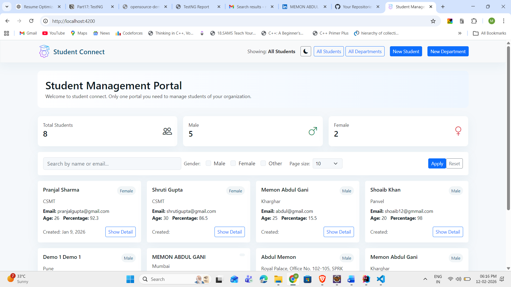
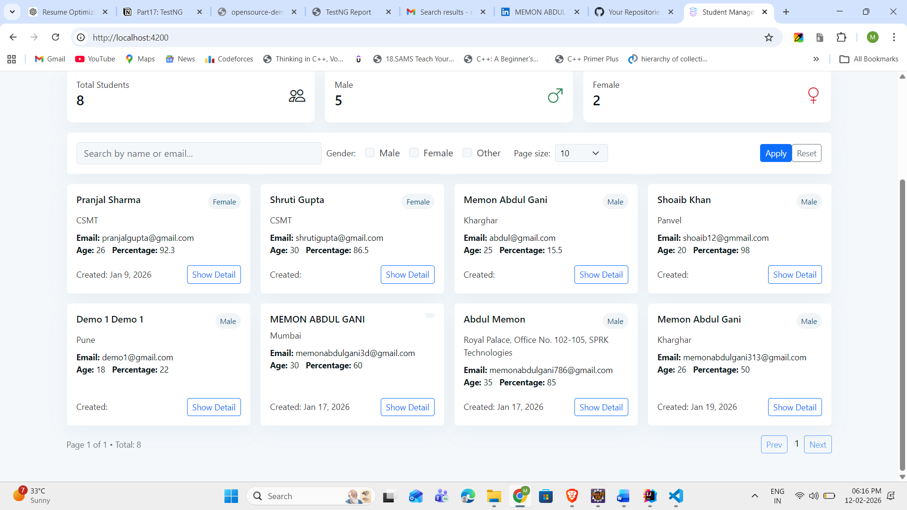
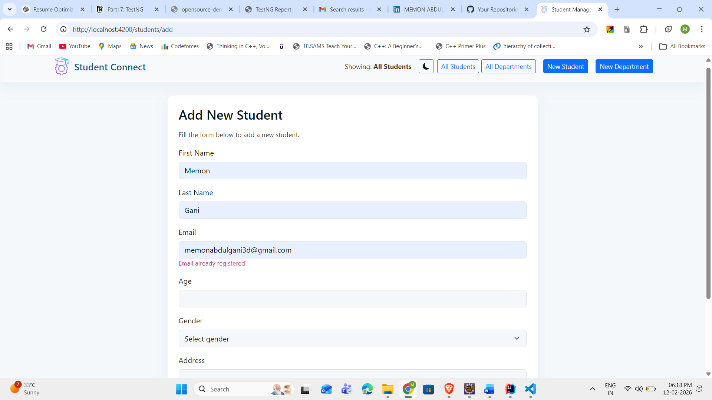
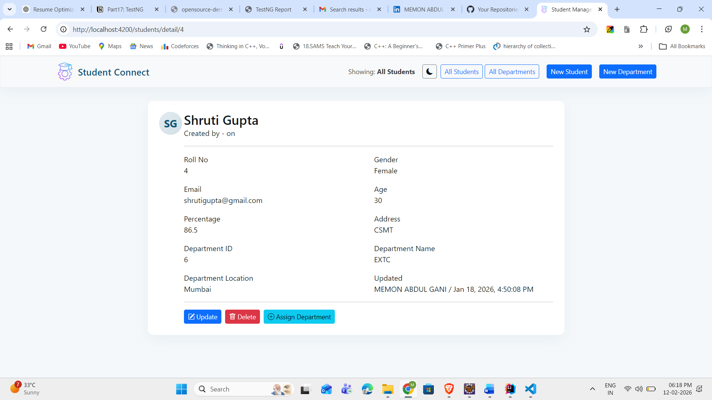
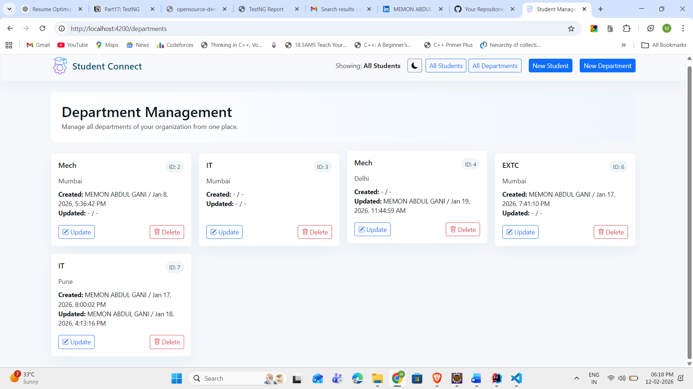
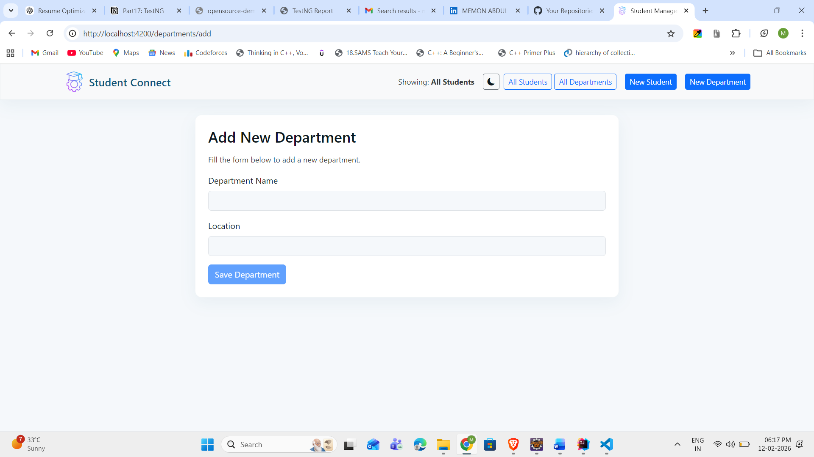
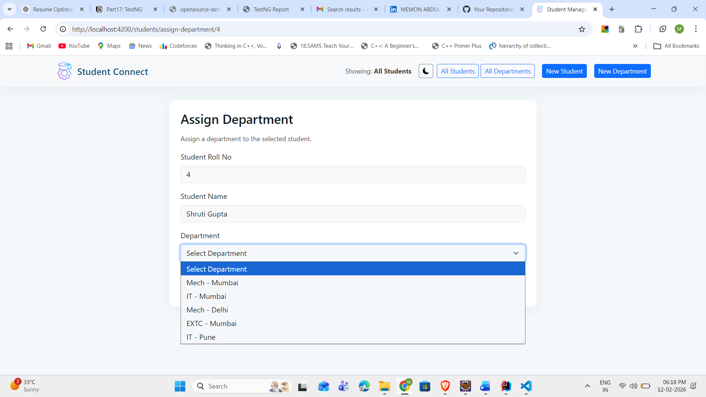

# 📚 Student Connect – Full Stack Student & Department Management System

## 📌 Project Overview

Student Connect is a full stack web application built to manage **students and departments** inside an organization or institute.

The system allows:

- Managing student records
- Managing departments
- Assigning departments to students
- Filtering students
- Viewing student details
- Maintaining audit tracking (Created By, Updated By, Time)

This project is built using **Spring Boot REST API (Backend)** and **Angular (Frontend)** following industry standard architecture and coding practices.

---

## 🏗 Tech Stack

### Backend

- Java 21+
- Spring Boot
- Spring Data JPA
- Hibernate
- REST API
- MySQL
- DTO Pattern
- Global Exception Handling
- Audit Aware Implementation

### Frontend

- Angular
- Bootstrap UI
- Reactive Forms
- HTTP Client API Integration

### Tools

- Maven
- Git
- IntelliJ IDEA
- VS Code
- Postman

---

## 📸 Application Preview

### Core Dashboard

| Feature            | Preview                           |
| ------------------ | --------------------------------- |
| Dashboard Overview |     |
| Student Listing    |  |

---

### Student Management

| Feature             | Preview                             |
| ------------------- | ----------------------------------- |
| Add Student         |     |
| Student Detail View |  |

---

### Department Management

| Feature         | Preview                                    |
| --------------- | ------------------------------------------ |
| Department List |  |
| Add Department  |         |

---

### Mapping Module

| Feature           | Preview                                |
| ----------------- | -------------------------------------- |
| Assign Department |  |

---

## 🧠 Backend Architecture (Industry Standard)

Backend follows clean layered architecture:

```
Controller → Service → Repository → Database
              ↓
            DTO Mapping
```

### Data Flow Pattern Used

```
Request DTO → Entity → Business Logic → Response DTO → Success Response Wrapper
```

Implemented Flow:

```
DTO → Entity → ResponseDTO → SuccessResponseDTO
```

This ensures:

- Clean API contract
- No direct entity exposure
- Secure and maintainable code
- Easy versioning in future

---

## 📂 Backend Package Structure

```
audit
config
constant
controller
dto
entity
exception
repository
service
util
```

### 💫 Important Highlights

✅ Global Exception Handler
✅ Custom Exception Classes
✅ Centralized Constants
✅ Generic Response Wrapper
✅ Audit Logging (Created / Updated tracking)

---

## ⚙ Features Implemented

### 👨‍🎓 Student Management

- Add Student
- Update Student
- Delete Student
- View Student Details
- Search Students (Name / Email)
- Filter by Gender
- Pagination Support

### 🏢 Department Management

- Add Department
- Update Department
- Delete Department
- View Department List

### 🔗 Relationship Management

- Assign Department to Student
- View Department Details inside Student Profile

---

## 📊 UI Screens Covered

### Dashboard

- Total Students Count
- Male Count
- Female Count
- Search + Filters
- Pagination

### Student Module

- Student List Cards
- Student Detail View
- Add Student Form
- Email Duplicate Validation

### Department Module

- Department List
- Add Department Form
- Update / Delete Options

### Assignment Module

- Assign Department Dropdown
- Student → Department Mapping

---

## 🔐 Validation & Error Handling

### Backend

- Global Exception Handling
- Custom Business Exceptions
- Email Duplicate Check
- Roll Number Validation
- Age Validation

### Frontend

- Form Validations
- Inline Error Messages

---

## 🧾 API Response Standardization

All APIs return structured response:

```
{
  statusCode,
  message,
  data
}
```

This helps:

- Frontend consistency
- Better debugging
- Industry standard API contract

---

## 🧩 Special Implementations

### 🕒 Audit Tracking

Tracks:

- Created By
- Created Time
- Updated By
- Updated Time

### 🧱 DTO Mapping Layer

Ensures:

- Entity Safety
- Loose Coupling
- Clean API Structure

---

## 🚀 Future Enhancements (Planned)

- JWT Authentication
- Role Based Access (Admin / User)
- Dashboard Charts
- Bulk Upload via Excel
- Email Notifications
- Docker Deployment
- CI/CD Pipeline

---

## ▶ How To Run Project

### Backend

```bash
git clone <repo>
cd backend
mvn clean install
mvn spring-boot:run
```

Runs on:

```
http://localhost:8080
```

---

### Frontend

```bash
cd frontend
npm install
ng serve
```

Runs on:

```
http://localhost:4200
```

---

## 💡 Why This Project Matters

This project demonstrates:

- Real industry backend architecture
- Proper DTO and response handling
- Clean Angular UI integration
- Exception driven API design
- Production ready coding approach

---

## 👨‍💻 Author

**Memon Abdul Gani**
Java Full Stack Developer | Corporate Trainer
